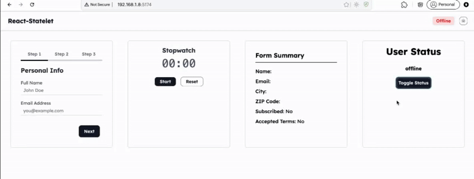
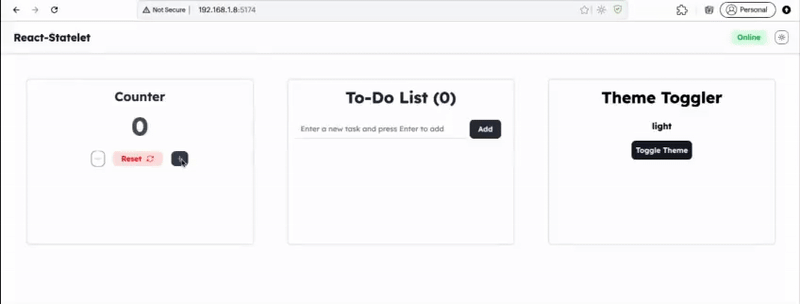
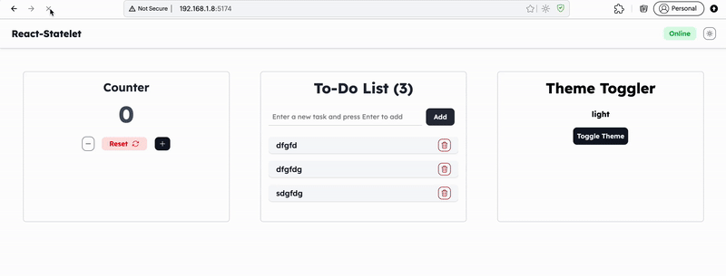
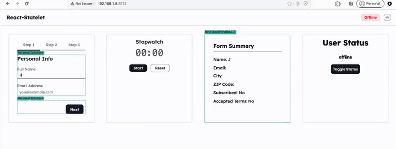

# 🧠✨ Introducing React-Statelet

Checkout https://www.npmjs.com/package/react-statelet

A lightweight state management tool for React that sits perfectly between simplicity and power.

---

## Why React-Statelet?

You start building a React app. It's simple at first—just a few components and some local state. Nothing fancy.

But as the app grows, the state starts needing to move around.  
You lift it up. Then you pass it down. Then you pass it *way* down.  
Suddenly, you're deep in **prop drilling** land.

So you reach for **Context** to make things cleaner.  
It works... until one small state change causes the **whole tree to re-render**.  
Not great.

Then comes the thought:  
**"Should I just use Redux?"**

But Redux? That’s a whole setup—action types, reducers, boilerplate everywhere.  
It feels like **overkill** for what you need.

---

## You just want something that:

- ✅ Shares state across components  
- ✅ Doesn't cause unnecessary re-renders  
- ✅ Is easy to use and doesn't take over your project  

---

## That’s exactly why we made **React-Statelet**

It’s a small pattern that sits right in the middle:

- 🪶 Lighter than Redux  
- 🧠 Smarter than plain Context  
- 🛠️ Way easier than lifting state all over the place  

---

## With React-Statelet, you get:

- 🏗️ A simple store with your reducer and initial state  
- 🧵 Easy dispatch hooks  
- 💾 Optional `localStorage` persistence  
- 🎯 Fine-tuned subscriptions that only re-render what’s needed  

No magic. No fuss.  
Just enough structure to keep your state clean without getting in your way.

If that sounds like what you’ve been missing—**give React-Statelet a try**.

---

# 🌟 Features

## ✅ 1. Minimal Boilerplate

Create a store with just a reducer and initial state.  
No provider nesting or complex setup.

```js
const isLoading = useStatelet(state => state.loading);
```

## ⚡  2. Fine-Grained Reactivity via Selectors
Efficient state subscription using `useSyncExternalStore` and selectors
means components only re-render when the selected part of the state changes.

```js
const status = useStatelet(state => state.status);
```



## 🚀 3. Easy Dispatch Functions
Create action dispatchers on the fly with `useCreateStateletAction`:

```js
const increment = useCreateStateletAction('INCREMENT');
increment();
```


## 💾 4. Persistent State Support
Preserve state across reloads using `localStorage` and a flexible whitelist:

```js
persistConfig: {
  key: "appState",
  whitelist: ["todos", "theme"]
}
```



Statelet restores only what you care about, automatically.

## 🧱 5. Composable and Scalable
You can define multiple stores or slice reducers and mount them under a unified store,
giving you modularity if you need it later.


The form being in a sub store context and only the selectors using these states will re-render

# 🧪 Try It Out
Lightweight, reactive, and just the right amount of structured.
React-Statelet is the missing piece in your React state toolkit.

## 🚀 Getting Started
Follow these simple steps to set up **React-Statelet** in your React project.
### 1. Install React-Statelet
```bash
npm install react-statelet
```

### 2. Create Your Store
Define your reducer and initial state in a new file (e.g. `store.js`):

```js
const initialState = {
  count: 0,
  loading: false,
};

function reducer(state, action) {
  switch (action.type) {
    case 'INCREMENT':
      return { ...state, count: state.count + 1 };
    case 'SET_LOADING':
      return { ...state, loading: action.payload };
    default:
      return state;
  }
}
```

### 3. Wrap Your App with `StateletProvider`
```jsx
// App.jsx
import React from 'react';
import { StateletProvider } from 'react-statelet';
import Counter from './Counter';

const persistConfig = {
  key: 'my-main-app-store',
  whitelist: ['count']
};

const storeValue = {
  initialState, reducer
}

function App() {
  return (
    <StateletProvider value={storeValue}>
      <Counter />
    </StateletProvider>
  );
}

export default App;
```

### 4. Use State and Dispatch in Components
Now use your state and actions in any component:

```jsx
// Counter.jsx
import React from 'react';
import { useCreateStateletAction, useStatelet } from "react-statelet";

function Counter() {
  const count = useStatelet(state => state.count);
  const increment = useCreateStateletAction('INCREMENT');

  return (
    <div>
      <h2>Count: {count}</h2>
      <button onClick={increment}>Increment</button>
    </div>
  );
}

export default Counter;
```

### 5. (Optional) Enable Local Storage Persistence
Pass a `persistConfig` to enable persistence:

```jsx

const persistConfig = {
  key: 'my-main-app-store',
  whitelist: ['count']
};

const storeValue = {
  initialState, reducer
}

function App() {
  return (
    <StateletProvider value={storeValue}>
      <Counter />
    </StateletProvider>
  );
}
```

Now you're all set!
Statelet is now managing your app’s state—without boilerplate, over-renders, or complexity.